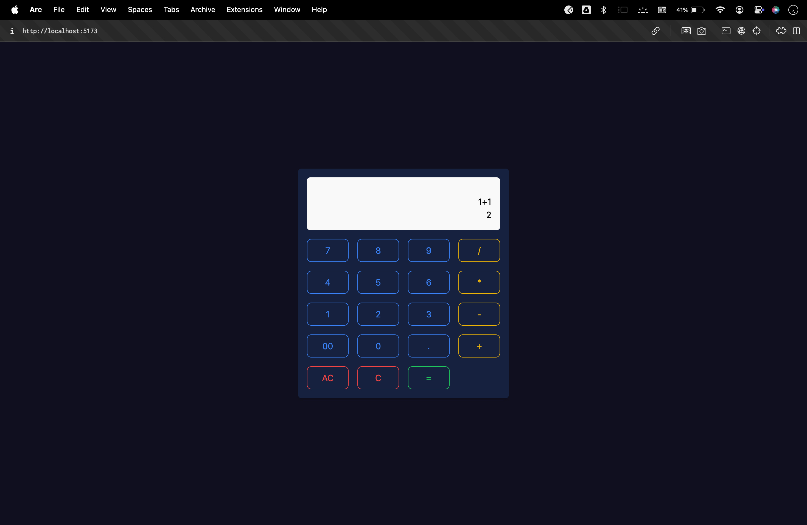

# Calculator App

A simple, responsive calculator app built with **React** and **Vite**. This app allows users to perform basic arithmetic operations in a sleek and intuitive user interface.

---

## 🚀 Features

- **Dynamic Input Display**: Real-time updates to user input and result display.
- **Arithmetic Operations**: Supports addition, subtraction, multiplication, division, and decimal calculations.
- **Clear and Delete**: Easily clear the screen or delete the last entered character.
- **Responsive Design**: Optimized for both desktop and mobile screens.
- **Custom Styling**: Styled with Tailwind CSS for a modern appearance.

---

## 📂 Project Structure

```plaintext
src/
├── assets/          # Static assets (if any)
├── components/
│   └── Calculator.jsx  # The main calculator component
├── App.jsx          # Root React component
├── main.jsx         # Entry point for the React app
├── index.css        # Global styles
├── tailwind.config.js # Tailwind CSS configuration
└── ...
```

---

## 🛠️ Built With

- **React**: JavaScript library for building user interfaces.
- **Vite**: Fast and efficient build tool for modern web projects.
- **Tailwind CSS**: Utility-first CSS framework for styling.

---

## 🖥️ Demo

### Desktop View  



---

## 🚧 Prerequisites

Ensure you have the following installed:

- [Node.js](https://nodejs.org/) (v14 or higher)
- [npm](https://www.npmjs.com/) or [yarn](https://yarnpkg.com/)

---

## 📦 Installation

1. Clone the repository:
   ```bash
   git clone https://github.com/thesaiteja24/basic-calculator-react.git
   ```
2. Navigate into the project directory:
   ```bash
   cd calculator-app
   ```
3. Install dependencies:
   ```bash
   npm install
   ```
   or
   ```bash
   yarn install
   ```

---

## 🛠️ Usage

1. Start the development server:
   ```bash
   npm run dev
   ```
   or
   ```bash
   yarn dev
   ```

2. Open your browser and navigate to:
   ```
   http://localhost:5173
   ```

---

## 🛡️ Testing the App

- Input numbers and operators to see dynamic calculations.
- Use **AC** to clear the input and result.
- Use **C** to delete the last entered character.

---

## 🌟 Customization

### Adding More Features
Will be adding more advanced calculator features like:
- Memory functions (MC, MR, M+, M-)
- Scientific operations (e.g., sin, cos, log)

### Styling
Update styles in `index.css` or directly within the Tailwind configuration file.

---

## 🧪 Build for Production

To create an optimized production build:
```bash
npm run build
```
or
```bash
yarn build
```

The build will be available in the `dist` folder.

---

## 📜 License

This project is licensed under the **MIT License**. See the [LICENSE](LICENSE) file for details.

---

## 🤝 Contributing

Contributions are welcome! Follow these steps:

1. Fork the repository.
2. Create a feature branch:
   ```bash
   git checkout -b feature-name
   ```
3. Commit your changes:
   ```bash
   git commit -m "Add some feature"
   ```
4. Push to the branch:
   ```bash
   git push origin feature-name
   ```
5. Open a Pull Request.

---

## 💬 Feedback

If you have any feedback or suggestions, feel free to reach out at [saiteja.patsa+github@gmail.com](mailto:saiteja.patsa+github@gmail.com) or create an issue on this repository.

---

## 📄 Acknowledgments

- **React** for the robust library.
- **Vite** for the amazing development experience.
- **Tailwind CSS** for elegant and simple styling.

---

Let me know if you'd like to personalize any sections further! 😊
